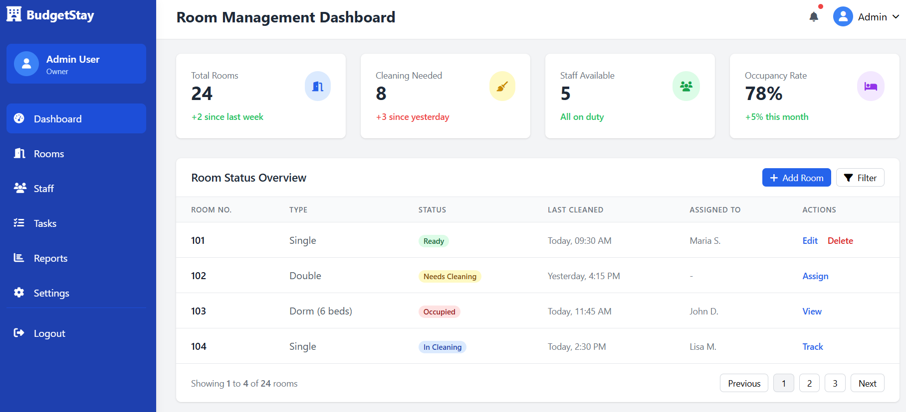
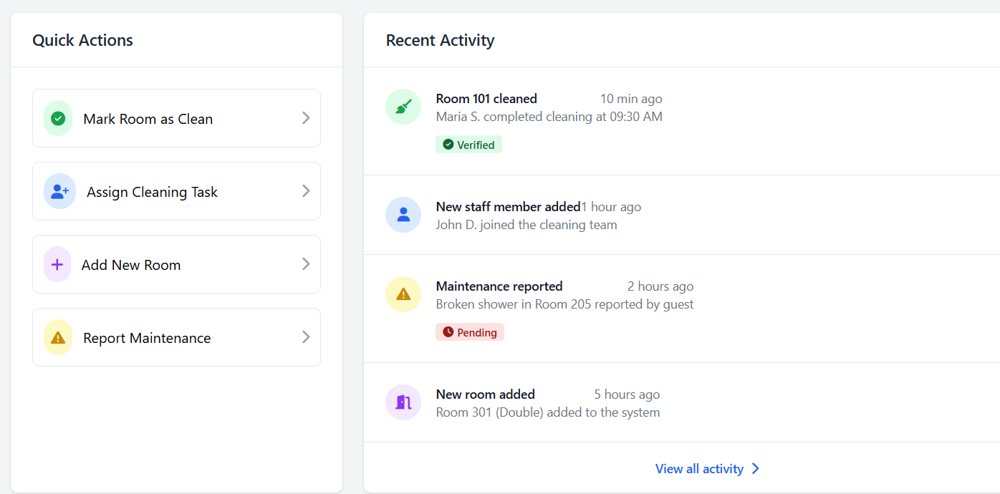
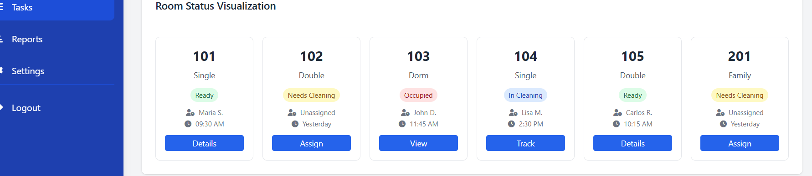

# 🏨 Budget Accommodation Management System

A lightweight, mobile-friendly Laravel web application to help budget accommodation owners efficiently manage room cleaning operations and coordinate with part-time staff.

## ✨ Features

- Role-based login for Admin (owner) and Staff (cleaners)
- Real-time room status dashboard
- Cleaning task assignment & tracking
- Timestamped history of cleaning activities
- Simple, responsive interface for mobile/tablet
- Built with Laravel, MySQL, and Tailwind CSS

## 👤 User Roles

- **Admin**: Full access to manage users, rooms, assign cleaning tasks, and view reports
- **Staff**: View assigned tasks and update room cleaning status

## Working Page

## ⚙️ Tech Stack

- Laravel 12 (Backend)
- MySQL (Database)
- Blade + Tailwind CSS (Frontend)
- Hosted on Hostinger

##  To-do

- [ ]  Implement authentication routes and blade templates
- [ ]  Add role column to users (admin / staff)
- [ ]  Middleware to restrict access based on role
- [ ]  Admin dashboard: room list with status
- [ ]  Add visual room status indicators (color-coded)
- [ ]  Room filtering (by status/type)
- [ ]  Create room add/edit/delete functionality
- [ ]  Assign room to staff and mark as “needs cleaning”
- [ ]  Staff dashboard: see assigned rooms
- [ ]  Form to mark room as "ready" + optional notes

## Done 

- [x] Database migrations and seeding

## 📦 Future Roadmap

- Photo verification of cleaned rooms
- Guest check-in/out tracking
- Maintenance request system
- REST API for mobile app
- Booking system integration
- Reporting & History
    - View cleaning logs per room
    - View logs per staff
    - Calculate simple turnover rate (rooms cleaned per day)
    - Export report to CSV or PDF (optional)
  
## 🔐 Security

- HTTPS, CSRF protection, role-based access control, and input validation
